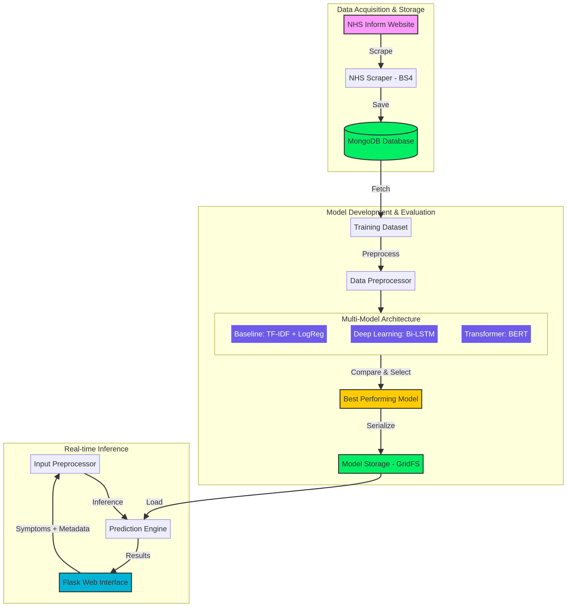

# Medical AI Diagnostics System 🏥🤖

An advanced, end-to-end AI-powered medical diagnostic system that analyzes patient symptoms and predicts potential medical conditions based on real-world data scraped directly from the **NHS (National Health Service)** website. This system leverages multiple AI models, including deep learning and transformer-based approaches, to provide accurate and context-aware diagnoses through an interactive web interface.

## 🚀 Key Features

*   **Automated Data Scraping (NHS):** A custom web scraper built with `BeautifulSoup` and `Requests` dynamically collects over 200 medical conditions, their symptoms, causes, and recommendations from the official NHS website, bypassing bot-detection mechanisms.
*   **Intelligent Data Preprocessing:** Utilizes `NLTK` for text cleaning, tokenization, and lemmatization. It also handles rare cases and applies data augmentation techniques to ensure a balanced and robust dataset for model training.
*   **Multi-Model AI Architecture:** The system employs a sophisticated multi-model approach for diagnosis:
    *   **Baseline Model:** A traditional machine learning model using TF-IDF vectorization combined with Logistic Regression for initial predictions.
    *   **Deep Learning Model:** A powerful Bi-directional LSTM (Long Short-Term Memory) network, enhanced with Spatial Dropout and Global Max Pooling layers, designed to capture complex sequential patterns in symptom descriptions.
    *   **Transformer Model:** Integrates the state-of-the-art **BERT** (`bert-base-uncased`) model from Hugging Face `transformers` for advanced natural language understanding and sequence classification, providing highly accurate predictions.
*   **Automated Model Selection:** During the training phase, the system automatically trains all three models (Baseline, LSTM, and BERT), evaluates their performance based on accuracy and F1-scores, and selects the highest-performing model for real-time inference.
*   **Context-Aware Predictions:** Beyond symptoms, the system incorporates user metadata such as age and gender to refine predictions, offering highly accurate, ranked probabilities for the top 3 most likely conditions.
*   **NoSQL Database Integration:** **MongoDB** is used as the primary database for persisting scraped medical conditions, storing training metrics, and serializing AI models (using GridFS for efficient storage of large `.h5` and `.pkl` files).
*   **Interactive Web Interface:** A user-friendly and responsive web application developed with **Flask** and **Bootstrap 5**, featuring a clean UI that allows users to trigger data scraping, initiate model training, and receive instant diagnoses seamlessly.

## 🛠️ Tech Stack

*   **Backend:** Python, Flask
*   **Web Scraping:** BeautifulSoup4, Requests
*   **Machine Learning / NLP:** TensorFlow, Keras, Hugging Face `transformers` (BERT), Scikit-Learn, NLTK
*   **Database:** MongoDB, PyMongo, GridFS
*   **Frontend:** HTML5, CSS3, Bootstrap 5, JavaScript (Fetch API)

## 📂 Project Structure

```text
├── app.py                   # Main Flask application with API routes and web interface
├── scraper.py               # NHS Web Scraper logic (handles user-agents, pagination)
├── preprocess.py            # Text cleaning, tokenization, feature extraction, dataset preparation
├── models.py                # Definitions for Baseline, LSTM, and BERT models; training and evaluation logic
├── db_utils.py              # MongoDB connection, data persistence, and GridFS operations
├── architecture_new.png     # Visual representation of the system architecture
├── README.md                # Project documentation (this file)
├── .gitignore               # Specifies intentionally untracked files to ignore
├── current_model_baseline.pkl # Serialized baseline model
├── current_model_encoder.pkl  # Serialized label encoder
├── current_model_model.h5     # Serialized Keras/TensorFlow model (LSTM/BERT)
├── current_model_tfidf.pkl    # Serialized TF-IDF vectorizer
├── current_model_tokenizer.pkl# Serialized tokenizer for deep learning models
└── __pycache__              # Python compiled bytecode cache
```

## ⚙️ System Architecture

The following diagram illustrates the overall architecture and data flow within the Medical AI Diagnostics System:



## 🚀 Getting Started

### Prerequisites

Before running the project, ensure you have the following installed:

*   Python 3.8+
*   MongoDB (Community Server)
*   `pip` (Python package installer)

### Installation

1.  **Clone the repository:**
    ```bash
    git clone <repository_url>
    cd medical-ai-diagnostics-system
    ```
    *(Note: Replace `<repository_url>` with the actual repository URL if available)*

2.  **Create a virtual environment (recommended):**
    ```bash
    python -m venv venv
    source venv/bin/activate  # On Windows, use `venv\Scripts\activate`
    ```

3.  **Install dependencies:**
    ```bash
    pip install -r requirements.txt
    ```
    *(Note: A `requirements.txt` file is assumed. If not present, you might need to create one with `pip freeze > requirements.txt` after installing individual packages listed in `Tech Stack`)*

4.  **Start MongoDB:**
    Ensure your MongoDB server is running. You can typically start it with `mongod` in your terminal.

### Running the Application

1.  **Run the Flask application:**
    ```bash
    python app.py
    ```

2.  **Access the web interface:**
    Open your web browser and navigate to `http://127.0.0.1:5000/` (or the address shown in your terminal).

## 💡 Usage

Once the application is running, you can interact with it via the web interface:

1.  **Scrape NHS Data:** Click the "1. Scrape NHS Data" button to fetch medical conditions from the NHS website. This may take some time.
2.  **Train AI Models:** After scraping, click the "2. Train AI Models" button to train the various AI models. The system will automatically select the best-performing model.
3.  **Get Diagnosis:** Enter patient symptoms, age, and gender into the respective fields and click "Get Diagnosis" to receive predictions for potential medical conditions.

## 🤝 Contributing

Contributions are welcome! Please feel free to fork the repository, create a new branch, and submit pull requests. For major changes, please open an issue first to discuss what you would like to change.

## 📄 License

This project is licensed under the MIT License - see the `LICENSE` file for details.


